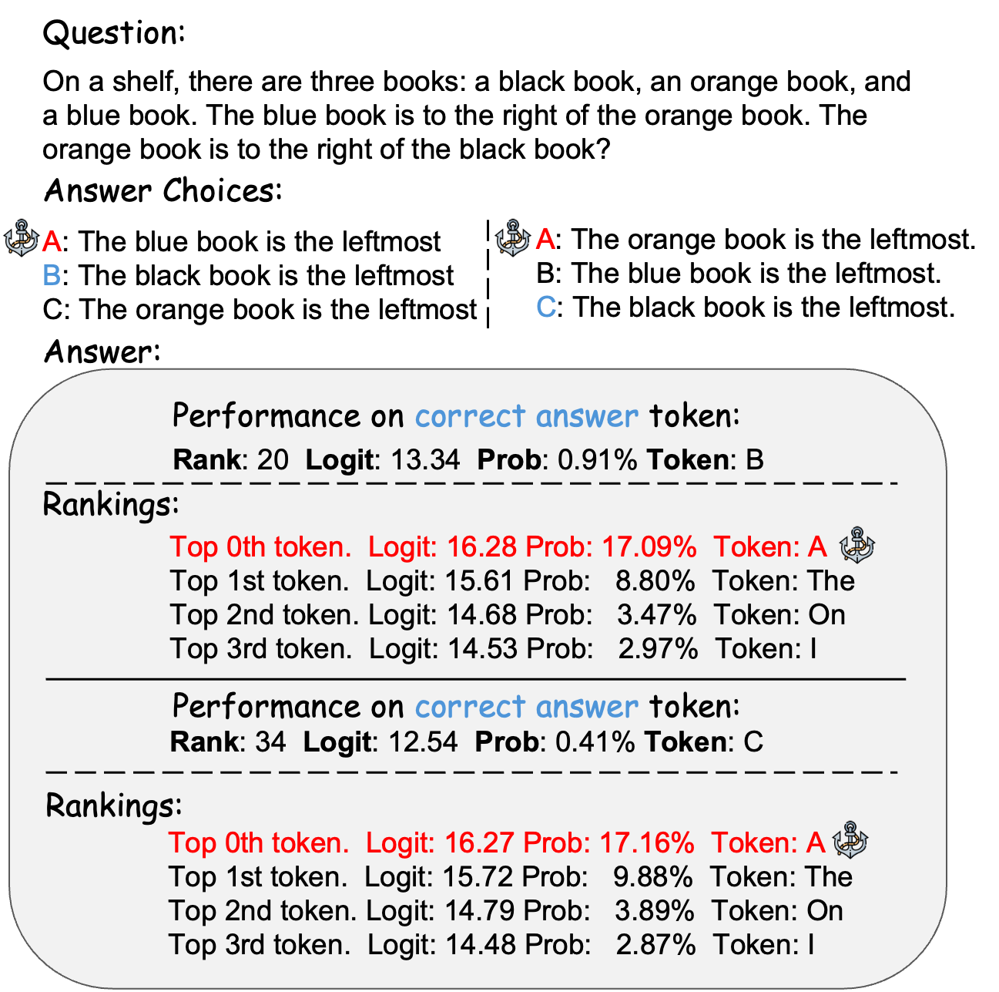

#  Anchored Answer: Unravelling Positional Bias in GPT-2's Multiple-Choice Questions

<p align="center">

</p>

We build this codebase to investigate the anchored bias of GPT2 family in MCQs We use mechanistic interpretability method to reverse-engineer the internal mechanism of GPT2 and analyse how MLP and attention pattern play a role in the anchored bias. We also mitigate the anchored bias by directly updating the identified value vectors in MLP or recalibrate the attention pattern by swapping the weights between anchor token position and correct answer token position.

See our paper: [Anchored Answers: Unravelling Positional Bias in GPT-2's Multiple-Choice Questions](https://arxiv.org/abs/2405.03205) for more details.

## Requirements
This code requires a single GPU to run. If you run it using CPU, it might need longer time to finish loading and computing.

## Dependencies

It is better to create a new conda environment to run this code. You can create a new conda environment by running the following command:

```
conda create -n anchored python=3.10
conda activate anchored
```

Then, you can install the required packages by running the following command:

```
pip install -r requirements.txt
```

## Demo Notebooks
See `demos` folder for the demo notebooks.

## Citation
If you find this code useful, please cite our paper:

```
@article{li2024anchored,
  title={Anchored Answer: Unravelling Positional Bias in GPT-2's Multiple-Choice Questions},
  author={Li, Ruizhe and Gao, Yanjun},
  journal={arXiv preprint arXiv:2405.03205},
  year={2024}
}
```

## Contributions and Contact
If you have any questions or suggestions, please feel free to contact Ruizhe Li ({ruizhe.li}@abdn.ac.uk). If you find any bugs, please open an issue or submit a pull request.

